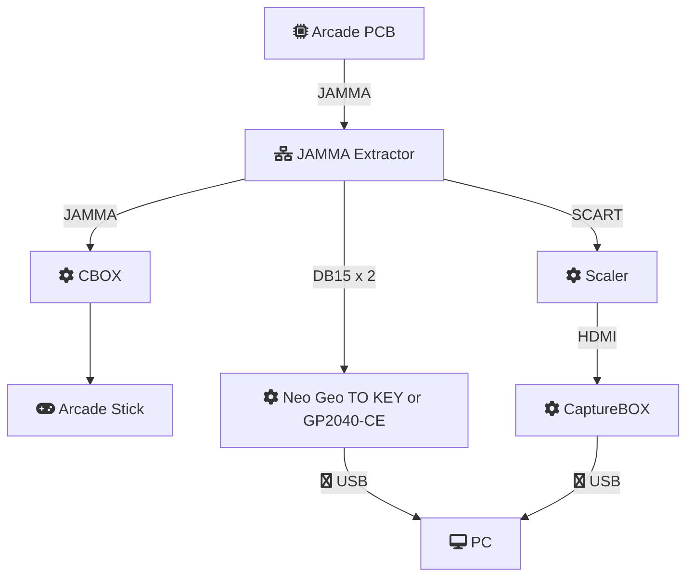
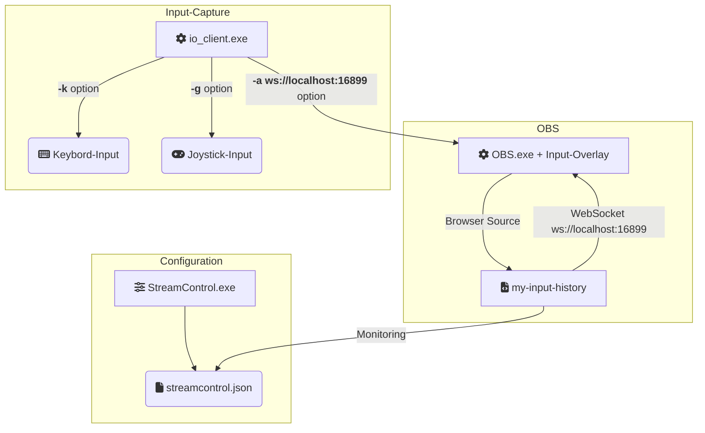

# OBS Input-Overlayむけ入力表示のプリセット

OBSのInput-Overlayで入力履歴、現在の入力の両方をオーバーレイ表示させるためのプリセットです。

[input-history]と[Arcade Stick Maker]をもとに改造したものです。


[input-history]: https://github.com/univrsal/input-overlay/tree/master/presets/input-history-windows
[Arcade Stick Maker]: https://codepen.io/ekubli/pen/ngzrKe?editors=1111
[Neo Geo TO JAMMA]: https://crownarcade.co.kr/products/neo-geo-to-jamma
[NAC SPLITFIRE]: https://kvclab.com/shopdetail/000000000076/
[VideoSplitter とくたん4号]: https://www.higenekodo.jp/shop/list.cgi?category=parts&file=1697291444

## 構成例

OBSを使ったアーケードゲームのキャプチャー構成に入力表示を組み込むための構成例です。

### キャプチャー機器の構成



- **JAMMA Extractor**  
  入力、ビデオ信号、音声を取り出すためのアダプタです。  
  ほかの選択として入力取り出し用のアダプタは [Neo Geo TO JAMMA] があります。  
  ビデオ信号と音声は [NAC SPLITFIRE] や [VideoSplitter とくたん4号] などがあります。  
  CBOXから分岐させることもできます。  

- **Neo Geo TO KEY or GP2040-CE**  
  Neo Geo TO KEYはDB15からの入力信号をキーボードにマッピングします。  
  GP2040-CEはDB15からの入力信号をゲームコントローラーにマッピングします。  
  1つのGP2040-CEで1Pと2P操作の両方をまかなえるようにして、PC側のデバイス選択を省略にできるようにしていますが、その場合は1プレイヤーごとに4ボタンまでのサポートになります。  
  キーアサインにあわせてGP2040-CEとDB15コネクタを接続する必要があります。  

- **Scaler、CaptureBOX、CBOX、PC**  
  これらは自身のものを利用してください。  


### OBSの構成



- **Input-Overlay**  
  OBSへインストールしてください。

- **io_client**  
  PCへの入力をWebSocket接続でOBSへ連携するために動作させます。
  ポート番号はOBSで設定したものを指定します。  
    
  コマンド例：  
  ```io_client.exe -a ws://localhost:16899 -k -g -n gaming_pc```

- **StreamControl**  
  設定変更に使用します。  
  使用するモードを設定します。  
  ポート番号はOBSで設定したものを指定します。  

## キーアサイン

Neo Geo TO KEY、GP2040-CE x 1pc、GP2040-CE x 2pcsの3つのモードをサポートします。
それぞれのキーアサインは以下の通りです。

|  JAMMA     | [Neo Geo TO KEY](#neo-geo-to-key) | [GP2040-CE x 1pc](#gp2040-ce-x-1pc) | [GP2040-CE x 2pcs](#gp2040-ce-x-2pcs) |
| :--------: | :------------: | :-------------: | :--------------: |
| 1P UP      | ARROW UP       | UP    GP02      | DEVICE #1 UP     |
| 1P DOWN    | ARROW DOWN     | DOWN  GP03      | DEVICE #1 DOWN   |
| 1P LEFT    | ARROW LEFT     | LEFT  GP04      | DEVICE #1 LEFT   |
| 1P RIGHT   | ARROW RIGHT    | RIGHT GP05      | DEVICE #1 RIGHT  |
| 1P BUTTON1 | KEYBOAD Q      | P1    GP10      | DEVICE #1 P1     |
| 1P BUTTON2 | KEYBOAD W      | K1    GP06      | DEVICE #1 K1     |
| 1P BUTTON3 | KEYBOAD E      | P2    GP11      | DEVICE #1 P2     |
| 1P BUTTON4 | KEYBOAD A      | K2    GP07      | DEVICE #1 K2     |
| 1P BUTTON5 | KEYBOAD S      |                 | DEVICE #1 R1     |
| 1P BUTTON6 | KEYBOAD D      |                 | DEVICE #1 R2     |
| 2P UP      | KEYBOAD U      | R1              | DEVICE #2 UP     |
| 2P DOWN    | KEYBOAD J      | L1              | DEVICE #2 DOWN   |
| 2P LEFT    | KEYBOAD K      | S1              | DEVICE #2 LEFT   |
| 2P RIGHT   | KEYBOAD H      | S2              | DEVICE #2 RIGHT  |
| 2P BUTTON1 | KEYPAD 7       | R2              | DEVICE #2 P1     |
| 2P BUTTON2 | KEYPAD 8       | L2              | DEVICE #2 K1     |
| 2P BUTTON3 | KEYPAD 9       | R3              | DEVICE #2 P2     |
| 2P BUTTON4 | KEYPAD 4       | L3              | DEVICE #2 K2     |
| 2P BUTTON5 | KEYPAD 5       |                 | DEVICE #2 R1     |
| 2P BUTTON6 | KEYPAD 6       |                 | DEVICE #2 R2     |


### Neo Geo TO KEY

Neo Geo TO KEYはartax 4.1ファームウェアを適用したものでキーアサインをしています。  
Neo Geo TO KEYの駆動にDB15からの5Vを利用する場合はUSBコネクタ側の電源ラインをカットすることを推奨します。  
デバイスIDは区別せずに入力を判断します。  
[ここ](https://crownarcade.co.kr/products/neo-geo-to-key-pci-type-usb-keyboard-interface)で売られています。

### GP2040-CE x 1pc

1個のGP2040-CEで1プレイヤー、2プレイヤー両方の入力をサポートします。  
デバイスIDは区別せずに入力を判断します。

### GP2040-CE x 2pcs

1プレイヤー、2プレイヤーで独立したGP2040-CEからの入力をサポートします。  
デバイスIDを区別するため設定で対応するIDを選択します。  
デフォルト設定はそれぞれ 1プレイヤー = 0、2プレイヤー = 1 としています。  
ゲームコントローラーとして認識されるものであればGP2040-CE以外のボードでもかまいません。

### GP2040-CEの設定

アナログ入力をハンドルできなかったのでD-Padのみをサポートします。

| Settings            |                    |
| :-----------------: | :----------------: |
| Input Mode          | XInput             |
| D-Pad Mode          | D-Pad              |
| SOCD Cleaning Mode  | Off                |
| Forced Setup Mode   | Disable Input Mode |

| Boot Input Modes    |                    |
| :-----------------: | :----------------: |
| All                 | No Mode Selected   |


## StreamControlからの設定

- Delay(frames)   
  画面表示までの遅延フレームを指定します。(0~999)  
- Opcity(%)  
  オーバーレイの透過度を指定します。(0~100)  
  100で不透過です。  
- Websocket  
  OBSと通信するためのポート番号を指定します。(0~65535)   
  16899がデフォルトポート番号です。
- Show History
  チェックONで入力履歴の表示を有効にします。
  - Max Lines  
    履歴の表示行数を指定します。(0~99)
  - Timeout(msec)  
    履歴の表示を消失させるまでの時間を指定します。(0~99999)
  - Top Align
    チェックONで上から履歴を表示させます。  
- Show Input  
  チェックONで最新の入力状態を表示します。
  - Layout  
    ボタン表示のレイアウトを選択します。
    - Line  
      4ボタン、主にネオジオ向けの横並びのボタンレイアウトです。
    - Box  
      4ボタン、主にネオジオのKOFで使用される箱型のボタンレイアウトです。
    - Samurai  
      4ボタン、主にネオジオのサムライスピリッツで使用される箱型のボタンレイアウトです。
    - 6-Button  
      6ボタン、主にストリートファイターで使用されるボタンレイアウトです。
- Input Device  
  入力デバイスを選択します。
  - Display Keycode
    チェックONでデバッグ用とで用いるキーコードを表示させます。
  - Optoins
    - Neo Geo TO KEY(artax)  
      [Neo Geo TO KEY](#neo-geo-to-key)を使用します。
    - GP2040-CE x 1pc  
      [GP2040-CE x 1pc](#gp2040-ce-x-1pc)を使用します。
    - GP2040-CE x 2pcs  
      [GP2040-CE x 2pcs](#gp2040-ce-x-2pcs)を使用します。
      - Device ID 1P  
        1プレイヤーとして使用するデバイスIDを指定します。(0~9)  
      - Device ID 2P  
        2プレイヤーとして使用するデバイスIDを指定します。(0~9)  
      
